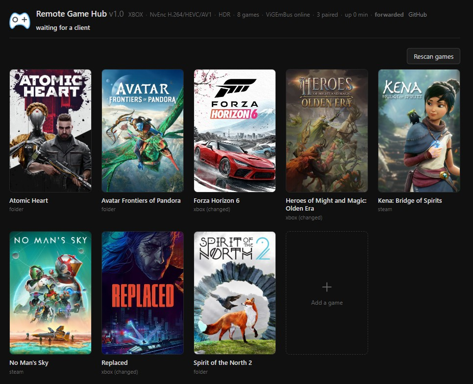

# Remote Game Hub

A server written from scratch to do what [LizardByte Sunshine](https://app.lizardbyte.dev/Sunshine/)
does: it speaks the NVIDIA Shield protocol (GameStream) and streams a Windows game host to its
clients. Fully compatible with the stock
[Moonlight clients](https://app.lizardbyte.dev/Sunshine/#Clients).

## Features

- Desktop and game streaming to any Moonlight client, up to 4K
- Encoding on the graphics card: NVENC on NVIDIA and AMF on AMD (H.264, HEVC and AV1) in 4:2:0
  or 4:4:4
- High dynamic range when the screen supports it
- Gamepad support, if controller bus is installed
- Games found automatically in the launchers — Steam, Xbox and Game Pass, Epic, GOG, EA,
  Battle.net — and in folders of your own
- Cover art fetched automatically for the games found, from the store catalogue
- Automatic discovery, so a client finds this machine without being given an address
- Optional UPnP forwarding of the streaming ports, for playing over the internet
- The screen is put into the mode the client asked for while it streams, and back afterwards

*WARNING: the application is not signed, so Windows will ask you to allow it to run.*

## Screenshots

  

## Pairing

There is nothing to set up. A client asks and shows four digits. You need open status page in browser (example: http://localhost or http://hostname), and on the page you give the device a
name, type the digits and press Save.

## Tech

- Written in C#, for Windows 11 or newer
- Discrete NVIDIA or AMD card only. If no monitor connected, you need an EDID emulator.
- **ViGEmBus** ([github.com/nefarius/ViGEmBus](https://github.com/nefarius/ViGEmBus/releases))
